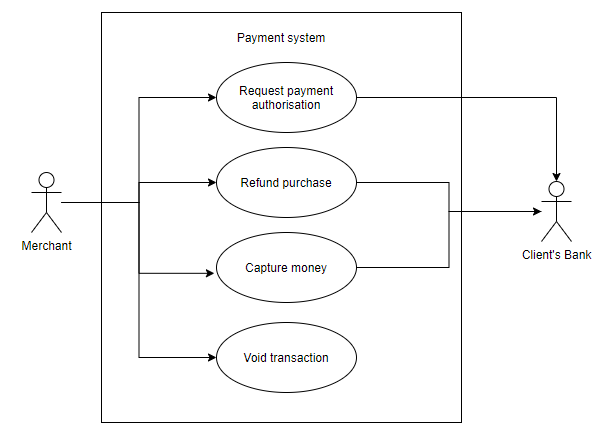
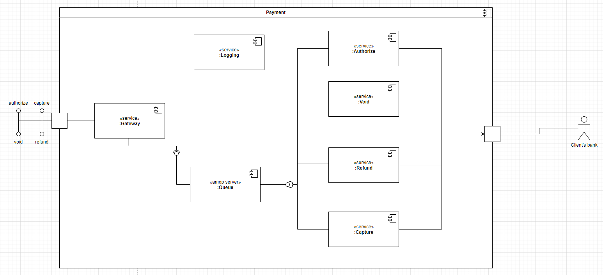
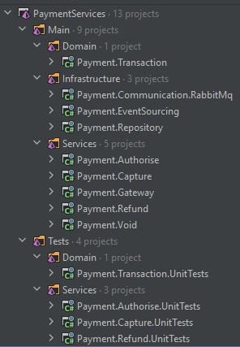

# Architecture Diagrams

Contents

- [Architecture Diagrams](#architecture-diagrams)
  - [Introduction](#introduction)
  - [Use case diagram](#use-case-diagram)
  - [Components diagram](#components-diagram)
  - [Project structure](#project-structure)

## Introduction

The intent of this page is to document the diagrams created in the initial phase of the project.

## Use case diagram

## Components diagram

This diagram is to show how the parts are connected in the system:

## Project structure

This is the solution structure:

